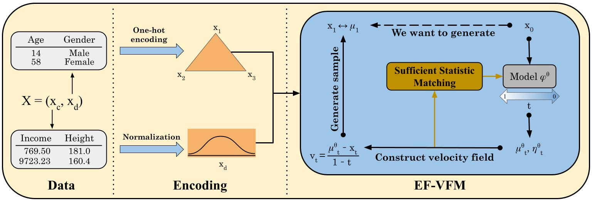

# Exponential Family Variational Flow Matching for Tabular Data Generation

<p align="center">
  <a href="https://github.com/andresguzco/ef-vfm/blob/main/LICENSE">
    
  </a>
  <a href="https://openreview.net/pdf?id=kjtvCSkSsy">
    
  </a>
  <a href="https://arxiv.org/pdf/2506.05940">
    
  </a>
</p>

<div align="center">
  
  <p><em> Figure 1: Exponential Family Variational Flow Matching (EF-VFM) is a generative modeling framework designed for mixed continuous
and discrete variables. By leveraging the exponential family and a mean-field assumption, EF-VFM efficiently matches the sufficient
statistics of the distributions via learned probability paths, ensuring state-of-the-art fidelity and diversity in synthetic data.</a></em></p>
</div>

This repository provides the prototypical implementation of EF-VFM: TabbyFlow (ICML, 2025).

## Latest Update

- [2025.09]：We are finally releasing our code! To speed the release and avoid compatibility isues, we removed the hyperparameter scripts we use to launch out experiments in our available cluster. Contact us if you have any questions!

## Introduction

EF-VFM uses the exponential family to jointly model different distributions with a single variational flow matching framework. Its key contributions are:  

1) We propose Exponential Family Variational Flow Matching (EF-VFM), an extension of VFM that incorporates exponential family distributions that facilitates efficient training via moment matching.
2) We establish a deep connection between VFM and a generalized flow matching objective through the lens of Bregman divergences, offering a theoretical foundation for learning probability paths over mixed data types.
3) To demonstrate the effectiveness of EF-VFM, we introduce TabbyFlow, a model that achieves state-of-the-art performance on standard tabular benchmarks, improving both fidelity and diversity in synthetic data generation.

The schema of EF-VFM is presented in the figure above. For more details, please refer to [our paper](https://arxiv.org/pdf/2506.05940).

## Environment Setup

Create the main environment with [ef_vfm.yaml](ef_vfm.yaml). This environment will be used for all tasks except for the evaluation of additional data fidelity metrics (i.e., $\alpha$-precision and $\beta$-recall scores)

```conda env create -f ef_vfm.yaml```

Create another environment with [synthcity.yaml](synthcity.yaml) to evaluate additional data fidelity metrics

```conda env create -f synthcity.yaml```

## Datasets Preparation

### Using the datasets experimented in the paper

Download raw datasets:

```python download_dataset.py```

Process datasets:

```python process_dataset.py```

### Using your own dataset

First, create a directory for your dataset in [./data](./data):

```cd data
mkdir <NAME_OF_YOUR_DATASET>
```

Compile your raw tabular data in .csv format. **The first row should be the header** indicating the name of each column, and the remaining rows are records. After finishing these steps, place you data's csv file in the directory you just created and name it as <NAME_OF_YOUR_DATASET>.csv. 

Then, create <NAME_OF_YOUR_DATASET>.json in [./data/Info](./data/Info). Write this file with the metadata of your dataset, covering the following information:

```{
    "name": "<NAME_OF_YOUR_DATASET>",
    "task_type": "[NAME_OF_TASK]", # binclass or regression
    "header": "infer",
    "column_names": null,
    "num_col_idx": [LIST],  # list of indices of numerical columns
    "cat_col_idx": [LIST],  # list of indices of categorical columns
    "target_col_idx": [list], # list of indices of the target columns (for MLE)
    "file_type": "csv",
    "data_path": "data/<NAME_OF_YOUR_DATASET>/<NAME_OF_YOUR_DATASET>.csv"
    "test_path": null,
}
```

Finally, run the following command to process your dataset:

```python process_dataset.py --dataname <NAME_OF_YOUR_DATASET>```

## Training TabbyFlow

To train an unconditional EF-VFM model across the entire table, run

```python main.py --dataname <NAME_OF_DATASET> --mode train```

Current Options of ```<NAME_OF_DATASET>``` are: adult, default, shoppers, magic, beijing, news

Wanb logging is enabled by default. To disable it and log locally, add the ```--no_wandb``` flag.

You must specify the experiment name, which will be used for logging and saving files, add ```--exp_name <your experiment name>```.

## Sampling and Evaluating TabbyFlow (Density, MLE, C2ST)

To sample synthetic tables from trained EF-VFM models and evaluate them, run

```python main.py --dataname <NAME_OF_DATASET> --mode test --report --no_wandb```

This will sample 20 synthetic tables randomly. Meanwhile, it will evaluate the density, mle, and c2st scores for each sample and report their average and standard deviation. The results will be printed out in the terminal, and the samples and detailed evaluation results will be placed in ./eval/report_runs/<EXP_NAME>/<NAME_OF_DATASET>/.

## Evaluating on Additional Fidelity Metrics ($\alpha$-precision and $\beta$-recall scores)

To evaluate EF-VFM on the additional fidelity metrics ($\alpha$-precision and $\beta$-recall scores), you need to first make sure that you have already generated some samples by the previous commands. Then, you need to switch to the `synthcity` environment (as the synthcity packet used to compute those metrics conflicts with the main environment), by running

```conda activate synthcity```

Then, evaluate the metrics by running

```python eval/eval_quality.py --dataname <NAME_OF_DATASET>```

Similarly, the results will be printed out in the terminal and added to ./eval/report_runs/<EXP_NAME>/<NAME_OF_DATASET>/

## Evaluating Data Privacy (DCR score)

To evalute the privacy metric DCR score, you first need to retrain all the models, as the metric requires an equal split between the training and testing data (our initial splits employ a 90/10 ratio). To retrain with an equal split, run the training command but append `_dcr` to ```<NAME_OF_DATASET>```

```python main.py --dataname <NAME_OF_DATASET>_dcr --mode train```

Then, test the models on DCR with the same `_dcr` suffix

```python main.py --dataname <NAME_OF_DATASET>_dcr --mode test --report --no_wandb```

## License

This work is licensed undeer the MIT License.

## Acknowledgement

This repo is built upon the previous work TabDiff's [[codebase]](https://github.com/MinkaiXu/TabDiff). Many thanks to Juntong, Minkai, Harper and Hengrui!

## Citation

```@inproceedings{
guzmancordero2025exponentialfamily,
title={Exponential Family Variational Flow Matching for Tabular Data Generation},
author={Andr\'es Guzm\'an-Cordero and Floor Eijkelboom and Jan-Willem van de Meent},
booktitle={The Forty-Second International Conference on Machine Learning},
year={2025},
url={https://openreview.net/forum?id=kjtvCSkSsy}
}
```

## Contact

If you encounter any problem or you have any question regarding the paper, please contact [Andrés](andresguzco@gmail.com) or [Floor](f.eijkelboom@uva.nl).
